# 客户在哪里？数据告诉你
_优达学城里一次数据发掘客户的探索之旅_

## 项目概述

&emsp;&emsp;在德国，作为一种传统传媒方式邮件依旧在日常生活中使用广泛。邮件广告自然也在日常生活中非常普遍。因此有效的通过邮件广告发掘潜在的客户是邮购公司的一个核心任务。有针对性的投放邮件广告，既可以提高了赢得客户的成功率，也有助于降低广告投放的成本。Arvato Financial Services为优达毕业项目提供了一家德国邮购公司客户的人口统计数据。数据中的对象被分为了客户和非客户两大类，数据关联了大量的相关信息。这个项目需要使用在课程中学到的非监督学习的方法来实现顾客分类，识别哪些人群是这家公司的基础核心用户。其次，针对该公司的一场邮购营销活动的人口统计数据，要求我们建立一个对潜在客户提供预测的模型，预测哪些人有可能成为该公司的客户。

&emsp;&emsp;这篇博文是我的优达学城数据科学家纳米学位毕业项目的一部分。以下记录了我在这个项目中的具体步骤和一些发现结果。项目主要分为以下四个部分：

1. **数据工程及预处理** 利用数据工程的一些常用补空，除余的方法对数据进行清洗，同时也在此过程中加深对数据理解
1. **顾客分类报告** 利用PCA主成分分析和KMeans聚类方法寻找出可以描述客户一些主要特征
1. **监督学习模型** 选择和创建合适的监督学习模型进行客户预测，这里我们尝试了随机森林和逻辑回归两个模型
1. **Kaggle竞赛** 利用我们在上一步创建的模型，针对给出的测试数据计算预处客户的结果，参加Kaggle上的结果评分

### 问题描述

&emsp;&emsp;在整个项目中我们的核心问题就是，如何通过数据提供的信息帮助业务发掘潜在的客户。

### 评价指标

&emsp;&emsp;发现客户，这是一个典型的二分类问题。在我们了解的模型中，验证模型有很多不同的指标可以帮助我们来分析模型的优劣。在最后使用的mailout_train中，可以看到只有1.2%的人是被标为营销活动中有回应的客户。使用ACC的评价指标是不合适的。我选择这里ROC_AUC作为我们在项目对模型的评价指标。通过True Positive Rate和False Positive Rate的关联产生AUC面积的来评估模型的效果。如果面积越大，证明模型越好。

-------------------

## 数据工程和预处理

&emsp;&emsp;在项目数据中包括四个数据文件。

* **Udacity_AZDIAS_052018.csv**: 德国的一般人口统计数据；891211 人（行）x 366 个特征（列）
* **Udacity_CUSTOMERS_052018.csv**: 邮购公司顾客的人口统计数据；191652 人（行）x 369 个特征（列）
* **Udacity_MAILOUT_052018_TRAIN.csv**: 营销活动的对象的人口统计数据；42982 人（行）x 367 个特征（列）
* **Udacity_MAILOUT_052018_TEST.csv**: 营销活动的对象的人口统计数据；42833 人（行）x 366个特征（列）

为了帮助更好的理解数据的内容和其实际的意义，还有另外两个描述数据的属性和值的文件。

* **DIAS Information Levels - Attributes 2017.xlsx**: 一个所有属性和描述的列表，按照信息的类别进行排列
* **DIAS Attributes - Values 2017.xlsx**: 一个详细的每个特征的数据值对应关系，按照字母顺序进行排列

通过这两个表格了解到，提供的特征有大致的以下几个分类

* Person 个人信息，除了性别，所处年龄段，出生年等常见的特征外，还包括过性格，度假喜好，健康状况，所处大概的社会和家庭状况，甚至与宗教信仰程度等。
* Household 家庭信息，近一两年来消费活动信息，大致消费的类型，理财投资等
* D19信息，这里是消费的活动记录信息，主要以消费产品类别划分，比如书籍，食品，旅行，电子科技产品等
* Building 房屋或居住条件
* 两个Microcell类数据中包含了很多细化的特折。这里有开车的品牌，车的数量，以至于车的发动机排量等信息。
* Postcode 邮政编码，这个信息也包含了对象所处地段的信息
* PLZ8 邮编8开头，因为是德国慕尼黑周边的地区。个人感觉这些特征的确可以单独拿出来考虑，或不加保留。但是最后我的这个实现中还是保留了这类特征。
* Community社区信息，比如工作，居住地周边人口数量等

&emsp;&emsp;我们首先加载了两个数据集Udacity_AZDIAS_052018.csv和Udacity_CUSTOMERS_052018.csv。我们知道每行数据代表一个单独的人。LNR很明显就是对应的人的索引列，所以我们将LNR列定义为DataFrame的索引列。两个数据有3列差异，这是明确的指出customers中有多余的特征'CUSTOMER_GROUP', 'ONLINE_PURCHASE', 'PRODUCT_GROUP'。我们在第一步就将其从customers中清理出去。使得customers和azdias的列数相同。

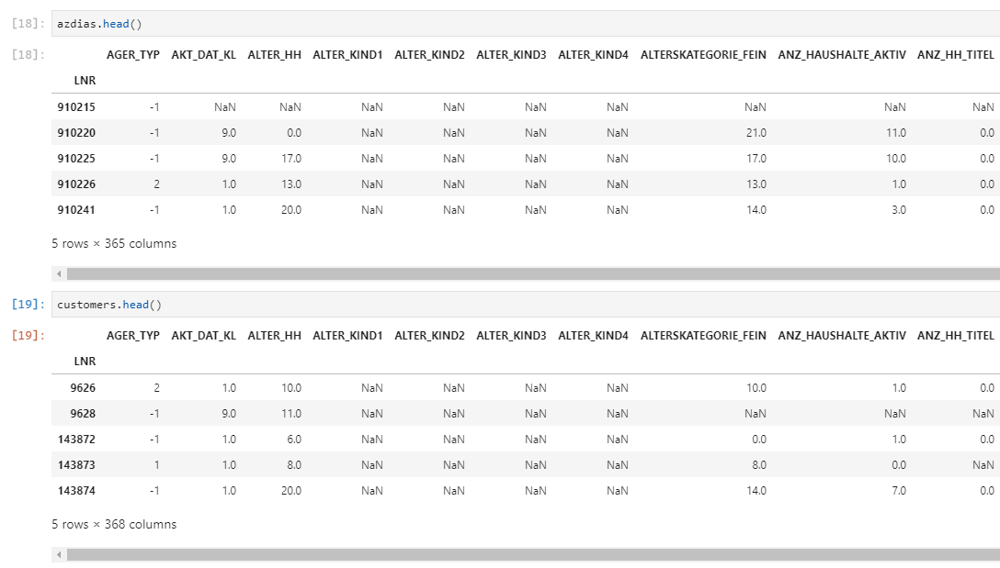

接下来在对数据的预处理过程中，通过了多次的迭代和分析，最后我们采用对特征按照不同取值类型和范围来加以填补空值的处理，然后再进行归一化的处理。整个数据的预处理，的确再项目的实现中消耗了近90%的时间。

### 针对警告信息处理

&emsp;&emsp;加载数据后就提示了警告信息。这里的问题出现在18和19列。通过查看发现这两列中的数据是对象（object）类型。对照了元数据集（xlsx文件）中对这两列数据的取值范围的描述，可以知道X和XX不是允许的数据值，另外在这两列中还存在字符串和数值类型值的混合。要完成的任务就是把X和XX替换为nan，并且将字符串转换为数值类型。

```text
column 18 label is CAMEO_DEUG_2015 dtype: object, it has values [nan 8.0 4.0 2.0 6.0 1.0 9.0 5.0 7.0 3.0 '4' '3' '7' '2' '8' '9' '6' '5'
 '1' 'X']
column 19 label is CAMEO_INTL_2015 dtype: object, it has values [nan 51.0 24.0 12.0 43.0 54.0 22.0 14.0 13.0 15.0 33.0 41.0 34.0 55.0 25.0
 23.0 31.0 52.0 35.0 45.0 44.0 32.0 '22' '24' '41' '12' '54' '51' '44'
 '35' '23' '25' '14' '34' '52' '55' '31' '32' '15' '13' '43' '33' '45'
 'XX']

```

处理后我们得到了的结果如下

```text
after cleanup column CAMEO_DEU_2015 has values: ['-1' '8A' '4C' '2A' '6B' '8C' '4A' '2D' '1A' '1E' '9D' '5C' '8B' '7A'
 '5D' '9E' '9B' '1B' '3D' '4E' '4B' '3C' '5A' '7B' '9A' '6D' '6E' '2C'
 '7C' '9C' '7D' '5E' '1D' '8D' '6C' '6A' '5B' '4D' '3A' '2B' '7E' '3B'
 '6F' '5F' '1C']
after cleanup column CAMEO_DEUG_2015 has values: [-1  8  4  2  6  1  9  5  7  3]
after cleanup column CAMEO_INTL_2015 has values: [-1 51 24 12 43 54 22 14 13 15 33 41 34 55 25 23 31 52 35 45 44 32]
```

再查看其它的值为对象类型的列，我还发现了其他的对象类型的列是D19_LETZTER_KAUF_BRANCHE， EINGEFUEGT_AM， OST_WEST_KZ和CAMEO_DEU_2015。这里我们也对其中的值进行了统一类型的操作。保留nan，其他的明确的值我将其统一成字符串类型。

### 分类值类型特征

&emsp;&emsp;在数据集中的两个列CAMEO_DEU_2015和OST_WEST_KZ是**分类值类型数据**（categorical data）。对其进行**独热编码 One-Hot Encoding**是我选的操作。利用pandas的`get_dummies`方法，同时列中的nan值也自动被排除出去了，减少了我们对空值的处理。通过这个操作，我们将两个列特征CAMEO_DEU_2015和OST_WEST_KZ转变为了新的46个特征。

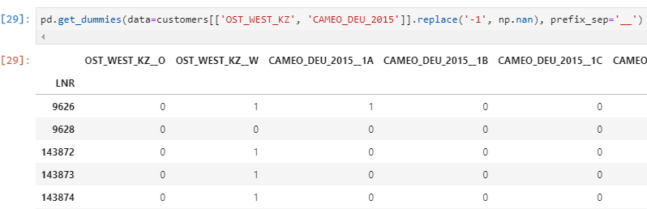

### 数值类型特征

&emsp;&emsp;在DIAS Attirbutes - Values 2017.xlsx中，有一类数据的值是连续的数值numerical value。

|	|Attribute	|Description	|Value	|Meaning|
|---|-----------|---------------|:-----:|-------|
|36	|ANZ_HAUSHALTE_AKTIV	|number of households in the building	|…	|numeric value (typically coded from 1-10)|
|37	|ANZ_HH_TITEL	|number of academic title holder in building	|…	|numeric value (typically coded from 1-10)|
|38	|ANZ_PERSONEN	|number of adult persons in the household	|…	|numeric value (typically coded from 1-3)|
|39	|ANZ_TITEL	|number of professional title holder in household	|…	|numeric value (typically coded from 1-10)|
|711	|GEBURTSJAHR	|year of birth	|…	|numeric value|
|1167|	KBA13_ANZAHL_PKW	|number of cars in the PLZ8	|…	|numeric value|
|1986|	MIN_GEBAEUDEJAHR	|year the building was first mentioned in our d...|	…|	numeric value|

对这些列我们采用了中值填补的方式填充nan。我们使用Sklearn中的`SimpleImputer(strategy='median')`。


### 有Unkown默认值的特征

&emsp;&emsp;同样在元数据的描述中，有另一类数据，它们的取值描述中有Unknown，也就是不明确值。我们把这些类似意义的meaning都找出来。

|meaning|
|-------|
|'unknown'|
|'unknown / no main age detectable'|
|'no transactions known'|
|'no transaction known'|
|'no Online-transactions within the last 12 months'|
|'Inactive'|
|'none'|

对应这些描述的值就可以用来作为默认值填充空值。但是我们还发现，这些默认含义的可能值在DIAS Attirbutes - Values 2017.xlsx中的value并不是完全单一的。有的时候会有两个值，比如-1，0 或者-1，9。这里将这些默认值先变为nan，然后用中值填替换处理。

|	|Attribute|	Value|
|---|----------|---------:|
|0	|AGER_TYP	|-1|
|5	|ALTERSKATEGORIE_GROB	|-1, 0|
|11	|ALTER_HH	|0|
|...	|...	|...|
|2251	|ZABEOTYP	|-1, 9|

### 没有元数据的特征

&emsp;&emsp;在customers和azdias的两个数据集中，我们一共有364个特征列。而在元数据DIAS Attributes - Values 2017.xlsx中，仅仅提供了314个特征信息。经过对比这些特征，同时也为了简化处理过程，对这里缺乏具体的元数据的特征我做了直接删除的处理。

### 重复或近意的特征

&emsp;&emsp;特征列LP_FAMILIE_GROB和LP_FAMILIE_FEIN，LP_LEBENSPHASE_GROB和LP_LEBENSPHASE_FEIN，还有LP_STATUS_GROB和LP_STATUS_FEIN是在描述同样的特征。因为它们的取值颗粒程度不同才有细致（FEIN）和粗略（GROB）的两个分类。同时，也通过图形的方式我们观察了数据值的具体分布，进一步证明了这些数据的重复性。下图是以azdias中这些列的取值分布对比。

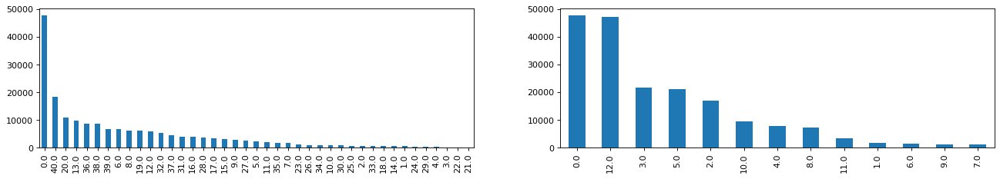

在这里我保留了细致特征，舍去了粗略特征，以避免特征的重复。同样在保留下来的LP_FAMILIE_FEIN，LP_LEBENSPHASE_FEIN和LP_STATUS_FEIN的列，使用中值填充的方法填补了空值。

&emsp;&emsp;在分析中还发现D19_LETZTER_KAUF_BRANCHE的值刚好对应了其它D19的列。CJT_KATALOGNUTZER也是类似情况，被其他CJT列所重复。我也将其删除。GEBURTSJAHR是出生年份，我们还有其他的列含有相关年龄的列ALTER_HH所以我们也决定忽略。

### 数据归一化

&emsp;&emsp;经过一番数据补空的工作后，最后采用了sklearn中的StandardScaler对补空后的每一个特征逐一进行了归一化操作。作为尝试我还使用过MinMaxScaler也做了另外一份归一化的数据。将经过清洗后的数据集保留在本地，以便后面的分析建模的过程直接取用。

---------------------------

## 顾客分类报告

&emsp;&emsp;在这部分中，目标是使用非监督学习技术来刻画公司已有顾客和德国一般人群的人口统计数据的关系。最后回答问题，一般人群中的哪一类人更可能成为邮购公司的顾客。这里我们运用到了PCA和KMeans聚类

### PCA主成分分析

&emsp;&emsp;经过预处理后得到的数据有348个特征被保留。预处理没有以行方式删除数据，所以保留了customers中的191652行数据。在azdias也还有891221行。对于这样高维度的数据使用了PCA主成分分析是一种普遍的降维做法。利用绘制的累计可解释方差贡献率曲线，通过观察的方式来决定希望保留信息量和降维后维度之间的关系。

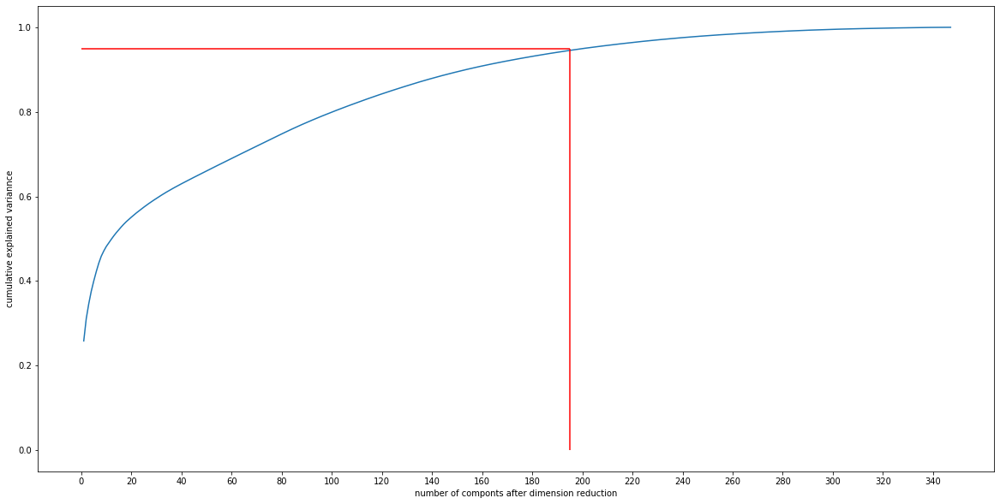

通过上图，为了保留95%的信息我选择降维到195。195个维度也可以理解为195个主成分。降维后PCA中的components_也刚好映射了相对348个原始特征的关系。在累计可解释方差贡献率曲线上可以明显看到，索引越小的主成分是保留数据信息量最大。经过PCA后的每个Dimension行是一个权重的向量，以此我们可以看到这个向量中每个原始特征对应的在这个dimension中产生的正负作用。下图显示了第一个component的影响最大的前五和后五个原始特征。

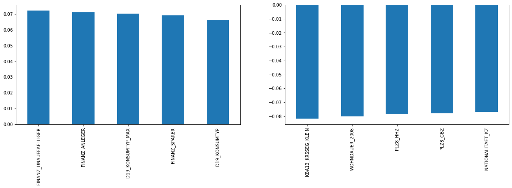

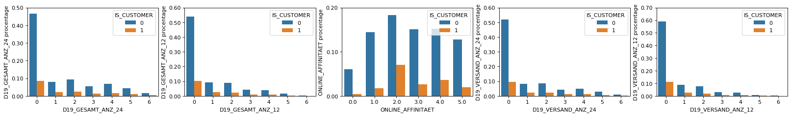


&emsp;&emsp;加上对前5列的取值分布观察，我对典型客户的解读：

* FINANZ_UNAUFFAELLIGER 客户中有财务问题的相对低
* FINANZ_ANLEGER 多数客户拥有较高的理财投资
* D19_KONSUMTYP_MAX 这是在Reviewer提示下保留的重要特征之一，但是我没有具体的描述信息
* FINANZ_SPARER 客户相对有高的存款积蓄
* D19_KONSUMTYP 消费结构，客户在美食消费占比高

### K-Means聚类

&emsp;&emsp;接下来使用PCA降维后的数据进行K-Means聚类处理。找到合适的聚类K值是聚类的一个核心的问题。这里我们利用肘部方法确定K=10。

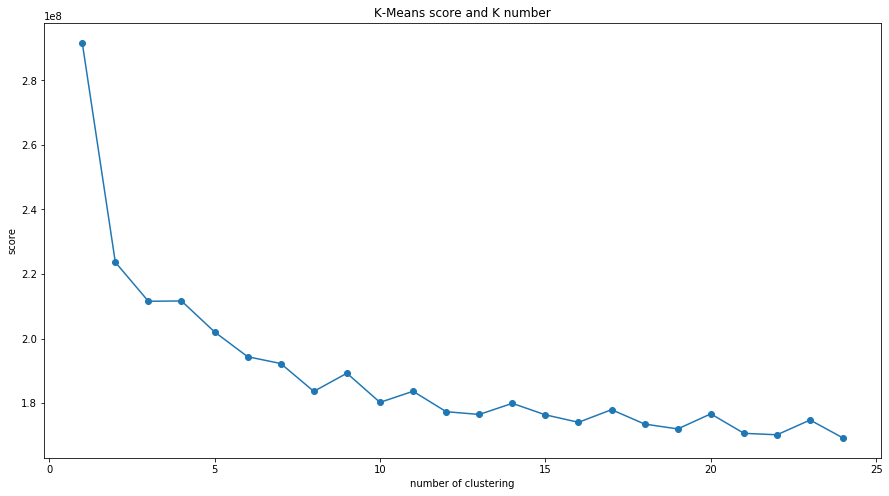

&emsp;&emsp;在使用KMeans聚类的过程中，我对比了sklearn中的KMeans和MiniBatchKMeans。对于同样的数据集使用K=10，可以看到miniBatchKMeans的性能明显好于KMeans。为了减少开发过程中的等待时间，所以我们采用了MiniBatchKMeans。但是具体的原因和两个分簇是否在结果上有差异，还有待进一步加以研究。

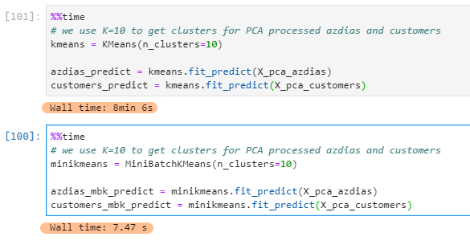

&emsp;&emsp;决定使用将azdias和customers都分割为10个簇后，利用图形对比分簇后的分布对比。在cluster 0, 1，2，4，5中我们看到客户比例高于普通人群。在这里的结论是，在这些簇中可以更大可能找到潜在的客户。

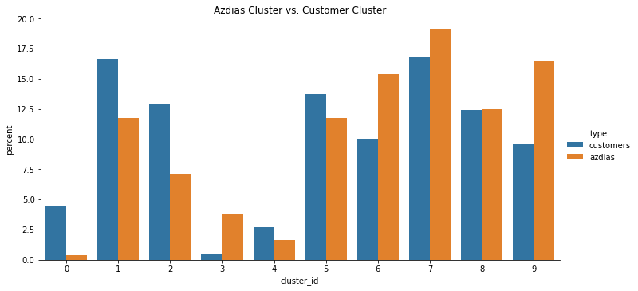

-----------------------------------

## 监督学习模型

&emsp;&emsp;这部分中，我们的目标是搭建一个模型来预测哪些人可能成为客户。使用MAILOUT_TRAIN数据集拆分为训练和测试集，RESPONSE列就是我们的标签列。在开始尝试建模工作前，我把所有之前数据预处理中方法整合成了一个函数，来简化后面的使用。

```python
def arvator_pipline(mailout_df, 
                    numeric_attributes, 
                    column_unknow_values, 
                    attributes_without_meta)
```

MAILOUT_TRAIN数据集中，我们看到RESPONSE为1的客户数量极低532（1.2%）一个典型的数据不平衡。

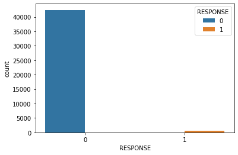

为了避免使用单纯的使ROC_AUC评估模型，我使用交叉验证的方法作为我们对模型评估的指标。

```python
cross_val_score(rfc, mailout_train_X, mailout_train_y, cv=10, scoring='roc_auc')
```

我尝试了两个常用的二分类模型 

* RandomForestClassifier随机森林分类
* LogisticRegression逻辑回归

首先在没有作任何参数调整的条件下，我们对比了随机森林和逻辑回归模型的性能。可以直观的通过ROC曲线提看到逻辑回归优于随机森林。

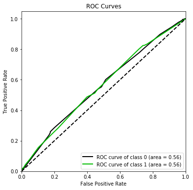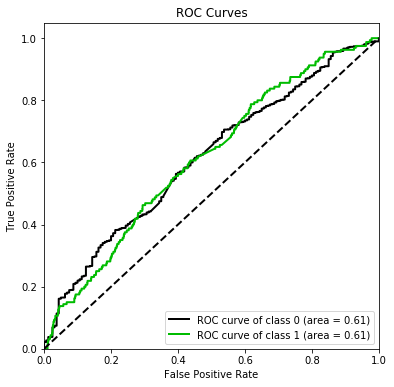

决定使用逻辑回归后，我进行了简单的手动调参，最终使用了如下参数，

```python
LogisticRegression(C=0.45, class_weight={0: 0.92, 1: 0.08}, dual=False,
                   fit_intercept=True, intercept_scaling=1, l1_ratio=None,
                   max_iter=100, multi_class='auto', n_jobs=None, penalty='l1',
                   random_state=None, solver='liblinear', tol=0.0001, verbose=0,
                   warm_start=False)
```

调参后的结果呈现为在ROC曲线如下图

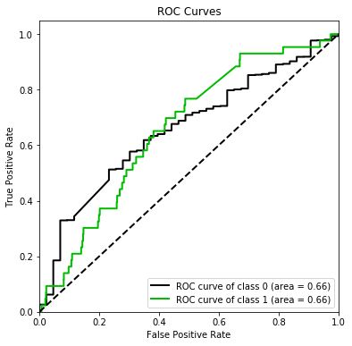

通过反思模型发现在train_test_split中加上了参数`stratify=mailout_train_y`，让训练数据避免不平衡性也可以作为调节模型的方法。这就是类似交叉验证打分是中使用的cv参数。

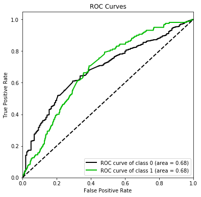

---------------------------

## Kaggle比赛

终于可以看看自己在项目中的成果了，我们把训练好的模型运用到了提供的MAILOUT_TEST中。最后把我们的看看我们的成绩


---------------------------
## 总结

反思我们的模型调参的过程，我们发现了一个重要方向就是我们的数据不平衡性。在MAIL_TRAIN中我们仅有1.2%的数据拥有Response=1。正对这一特点，在调参的过程中对于参数`class_weight={0: 0.92, 1: 0.08}`修改。结果在ROC评分上相对其它参数的调节上有很大的提高。起初我们在拆分训练和测试数据上没有为数据不平衡加以考虑。在最后尝试中，对train_test_split中加上了参数`stratify=mailout_train_y`也对模型有了很大的提高。这个参数也弥补了数据不平衡对模型的负面影响。这里的结论是，在数据平衡性不好的情况下，有针对的调差和拆分数据可以提高模型的性能。

通过这个毕业项目，让我有机会从头至尾的了解到了一个真实数据项目的概貌。从开始探索原始数据，运用数据工程对数据进行清洗处理，针对实际问题构建模型到最后模型评估和调试是一个复杂而有有趣的过程。而且每一个步骤都可以不断的作为一个单独的方向加以提升和改进。诸如：
    
* 数据预处理中，我们比较粗略的就删除了虽然没有描述的特征。在选取特征上是可以更加细致的了解特征后再加以筛选。
* 我仅用了一些简单的手动调参的方法改进模型，其实还有很多自动调参的方法可以加以运用，更好的提高效率和调参效果
* 建模开始挑选的模型只有两个，这是过与狭小有限的，对更多的模型中进行初步选取也一定会为提高建模的效果
* 当然，由于个人再Python上的经验有限，提高使用numpy，pandas和sklearn了解和经验也会是我个人的下一个学习目标

最后在这里，要为优达学城数据科学家课程在这里点赞。感谢你们提供的精彩课程和周到的服务和指导，通过这个课程为我通向打开数据科学的大门。

_项目的具体代码可以在我的[Github](https://github.com/lqiang79/udacity_DSND_arvato)上找到。_

---------------------------


#### 参阅资料

* [特征选择(Feature Selection)方法汇总](https://zhuanlan.zhihu.com/p/74198735)
* [Feature Selection with sklearn and Pandas](https://towardsdatascience.com/feature-selection-with-pandas-e3690ad8504b)
* [Categorical Data](https://towardsdatascience.com/understanding-feature-engineering-part-2-categorical-data-f54324193e63)
* [What is One Hot Encoding? Why And When do you have to use it?](https://hackernoon.com/what-is-one-hot-encoding-why-and-when-do-you-have-to-use-it-e3c6186d008f)
* [How to Use ROC Curves and Precision-Recall Curves for Classification in Python](https://machinelearningmastery.com/roc-curves-and-precision-recall-curves-for-classification-in-python/)
* [理解主成分分析 (PCA)](https://zhuanlan.zhihu.com/p/37810506)
* [First steps with Scikit-plot](https://scikit-plot.readthedocs.io/en/stable/Quickstart.html)