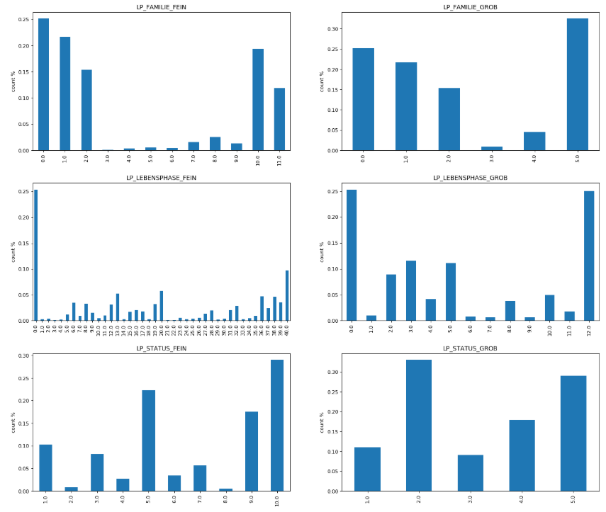

# 为 Arvato Financial Services 金融服务公司实现一个顾客分类报告

## 项目概述

在德国，邮件在日常生活中的使用还是特别广泛的。而且通过邮件收到广告也是日常生活中非常普遍的。所以，有效的通过邮件广告发现潜在的客户，有针对性的投放邮件广告，不仅降低广告投放成本，同时也提高了赢得客户的成功率。Arvator Financial Service这里为毕业项目提供了一家德国邮购公司的客户的人口统计数据。这些数据被分为了两大类：客户和非客户。在这里我们需要使用在课程中学到的非监督学习技术来实现顾客分类，识别出那些人群是这家公司的基础核心用户。另外，该公司的一场邮购活动的营销对象的人口统计数据提供了第三个数据集，我们将建立一个模型来，对这个数据集中的人提供预测。预测哪些人可能成为该公司的客户。

这篇博文是我的优达学城数据科学家纳米学位毕业项目的一部分。以下记录了我们在这个项目中的具体是步骤和一些发现结果。我们的项目主要分为一下几个部分：

1. 数据探索及处理
1. 顾客分类报告
1. 监督学习模型
1. Kaggle竞赛

### 问题描述

在整个项目中我们的核心问题就是，如何通过数据提供的信息帮助业务发掘潜在的客户。

### 评价指标

在顾客分类报告部分中，我们采用了非监督学习的方法去寻找数据中哪些特征是区别客户和非客户的主要特征。这里我们利用PCA降维的方式找到主要的component,在第二个监督学习建模的部分，我们创建模型后*我们的评价指标*

## 数据探索和预处理

项目数据中包括四个数据文件

* Udacity_AZDIAS_052018.csv: 德国的一般人口统计数据；891211 人（行）x 366 个特征（列）
* Udacity_CUSTOMERS_052018.csv: 邮购公司顾客的人口统计数据；191652 人（行）x 369 个特征（列）
* Udacity_MAILOUT_052018_TRAIN.csv: 营销活动的对象的人口统计数据；42982 人（行）x 367 个特征（列）
* Udacity_MAILOUT_052018_TEST.csv: 营销活动的对象的人口统计数据；42833 人（行）x 366个特征（列）

为了帮助我们在项目中更好的理解数据的内容和其实际的意义，我们还获得了另外两个描述数据的属性和值的文件。在这里我们认为这就是元数据信息集。LN

* DIAS Information Levels - Attributes 2017.xlsx: 一个所有属性和描述的列表，按照信息的类别进行排列
* DIAS Attributes - Values 2017.xlsx: 一个详细的每个特征的数据值对应关系，按照字母顺序进行排列

我们首先加载了两个数据集Udacity_AZDIAS_052018.csv和Udacity_CUSTOMERS_052018.csv。我们知道每行数据代表一个单独的人。LNR很明显就是对应的人的索引列，所以我们将LNR列定义为DataFrame的索引列。两个数据有3列差异，这是明确的指出customers中有多余的特征'CUSTOMER_GROUP', 'ONLINE_PURCHASE', 'PRODUCT_GROUP'。我们在第一步就将其从customers中清理出去。使得customers和azdias的列数相同。

接下来在我们对数据的预处理过程中，通过了多次的迭代和分析，最后我们采用对特征按照不同取值类型和范围来加以填补空值的处理，然后再进行归一化的处理。整个数据的预处理，的确再项目的实现中消耗了近80%的时间。

### 针对警告信息处理

我们就看到了加载数据后提示中提到的警告信息，出现在18和19列。这里我们通过查看，发现这两列中的数据是对象（object）类型有混乱的情况。这里我么也对照了元数据集中对这两列数据的可能的值的描述，发现这里同时有X和XX不是允许的数据值，另外还存在字符串和数值类型值的混合。我们把X和XX替换为nan，并且将字符串转换为数值类型。

```text
column 18 label is CAMEO_DEUG_2015 dtype: object, it has values [nan 8.0 4.0 2.0 6.0 1.0 9.0 5.0 7.0 3.0 '4' '3' '7' '2' '8' '9' '6' '5'
 '1' 'X']
column 19 label is CAMEO_INTL_2015 dtype: object, it has values [nan 51.0 24.0 12.0 43.0 54.0 22.0 14.0 13.0 15.0 33.0 41.0 34.0 55.0 25.0
 23.0 31.0 52.0 35.0 45.0 44.0 32.0 '22' '24' '41' '12' '54' '51' '44'
 '35' '23' '25' '14' '34' '52' '55' '31' '32' '15' '13' '43' '33' '45'
 'XX']

```
处理后我们得到了的结果如下

```
after cleanup column CAMEO_DEU_2015 has values: ['-1' '8A' '4C' '2A' '6B' '8C' '4A' '2D' '1A' '1E' '9D' '5C' '8B' '7A'
 '5D' '9E' '9B' '1B' '3D' '4E' '4B' '3C' '5A' '7B' '9A' '6D' '6E' '2C'
 '7C' '9C' '7D' '5E' '1D' '8D' '6C' '6A' '5B' '4D' '3A' '2B' '7E' '3B'
 '6F' '5F' '1C']
after cleanup column CAMEO_DEUG_2015 has values: [-1  8  4  2  6  1  9  5  7  3]
after cleanup column CAMEO_INTL_2015 has values: [-1 51 24 12 43 54 22 14 13 15 33 41 34 55 25 23 31 52 35 45 44 32]
```

对象类型的列给我们提示，我们还发现了其他的对象类型的列D19_LETZTER_KAUF_BRANCHE， EINGEFUEGT_AM， OST_WEST_KZ和CAMEO_DEU_2015，对其中的值进行了统一化的操作，保留了nan，其他的明确的值我们将其统一成字符串。

### 分类值类型特征处理

列CAMEO_DEU_2015和OST_WEST_KZ是分类值，这里我们对其进行one hot编码。这里我们利用pandas的`get_dummies`方法,同时列中的nan值也同时被排除出去了，减少了我们对空值的处理。通过这个操作，我们将两个列特征CAMEO_DEU_2015和OST_WEST_KZ转变为了新的46个特征。

### 数值类型特征处理

在DIAS Attirbutes - Values 2017.xlsx中，我们发现，有一类数据是连续的数值型（numerical value)。这些列我们采用了中值填补的方式填充nan。我们利用Sklearn中的`SimpleImputer(strategy='median')`

### 有Unkown默认值的特征

同样也是在元数据的描述中，一类数据存在这类似的默认描述。在含义meaning中都有类似的描述

|meaning|
|-------|
|'unknown'|
|'unknown / no main age detectable'|
|'no transactions known'|
|'no transaction known'|
|'no Online-transactions within the last 12 months'|
|'Inactive'|
|'none'|

对应这些描述的值就是我们可以用来填充空值的默认值。但是我们还发现，这些默认含义的可能值在DIAS Attirbutes - Values 2017.xlsx中的value并不是完全单一的。有的时候会有两个值，比如-1，0 或者-1，9。这里我们采用第一个出现的默认值，将第二个默认值也做替换处理。

|	|Attribute|	Value|
|---|----------|---------:|
|0	|AGER_TYP	|-1|
|5	|ALTERSKATEGORIE_GROB	|-1, 0|
|11	|ALTER_HH	|0|
|...	|...	|...|
|2251	|ZABEOTYP	|-1, 9|

### 没有元数据的特征

在customers和azdias的两个数据集中，我们一共有364个特征列。在元数据DIAS Attributes - Values 2017.xlsx中，仅仅提供了314个特征信息。我们做了一些具体分分析。ANZ_STATISTISCHE_HAUSHALTE，EXTSEL992有大量的数值，但是我们这里缺乏具体的meta数据，这里我们决定不再保留。

### 重复或近意的特征

特征列LP_FAMILIE_GROB和LP_FAMILIE_FEIN，LP_LEBENSPHASE_GROB和LP_LEBENSPHASE_FEIN，还有LP_STATUS_GROB和LP_STATUS_FEIN是在描述同样的特征，不过由于取值的颗粒程度不同而产生了细致的（FEIN）和粗略的（GROB）的区别。同时，也通过图形的方式我们观察了数据值的具体分布，进一步证明了这些数据的重复性。下图是以LP_LEBENSPHASE_FEIN和LP_LEBENSPHASE_GROB的对比。



在这里我们保留了细致的特征，舍去了粗略的特征，以避免特征的重复。同样在保留下来的LP_FAMILIE_FEIN， LP_LEBENSPHASE_FEIN和LP_STATUS_FEIN的列，我们也使用中值填充的方式填补了空值。

在分析中我们还发现D19_LETZTER_KAUF_BRANCHE的值刚好对应了其他D19的列。CJT_KATALOGNUTZER也是类似情况，被其他CJT列所重复。在我的实现中我们也将其删除了。

GEBURTSJAHR是出身年份，我们还有其他的列含有相关年龄的列ALTER_HH所以我们也决定忽略。

### 数据归一化

经过一番数据补空的工作后，我们采用了sklearn中的StandardScaler对数据进行归一化的出列。我们对补空后的每一个特征逐一进行了归一化操作。

---------------------------

## 2.顾客分类报告

在这部分中，目标是使用非监督学习技术来刻画公司已有顾客和德国一般人群的人口统计数据的关系。最后回答问题，一般人群中的哪一类人更可能是邮购公司的主要核心顾客，哪些人则很可能不是。

### PCA主成分分析

在预处理过程中我们删除了缺少描述的特征，其它特征我们做了保留，最后得到的还有348个列。在customers有191652行数据。在azdias中有891221行。对于这样高维度的数据使用了PCA主成分分析是一种普遍的降维做法。首先我们绘制的累计可解释方差贡献率曲线，通过观察的方式来决定希望保留信息量和降维后维度之间的关系。


在图上可以看到为了保留95%的信息，看到我们选择降维到195。这195个维度刚好可以理解为保留的新的主成分。经过了降维后，我们对新的主成分以及他和原始特征之间的关系及加以分析。

*TODO*

### K-Means 聚类

通过K-Means聚类，找到合适的K聚类的数量是一个核心的问题。这里我们利用肘部方法确定K的值。

通过上图，我们选择聚类的数量K=10。

在使用kmeans我们还对比了sklearn中的KMeans和MiniBatchKMeans。对于同样的数据集我们可以看到miniBatchKMeans的性能明显好于KMeans。所以我们采用了MiniBatchKMeans。


---------------------------

## 问题描述

## 评价指标

## 分析

## 数据预处理

### 数据的本信息

### 清除不需要的信息

### 

1. cleanup the differnt column from customers

## extract special columns from customers

customerSpecialColumns = ['CUSTOMER_GROUP', 'ONLINE_PURCHASE', 'PRODUCT_GROUP']

20000 sample:
clusters= 2 silhouette_score= -0.005550678780112048 inertia_= 3864191.8904432566
clusters= 3 silhouette_score= 0.003387561497095185 inertia_= 3768089.3112894897
clusters= 4 silhouette_score= 0.007278255762319557 inertia_= 3727637.6865278143
clusters= 5 silhouette_score= 0.010505625548645873 inertia_= 3693784.491780014
clusters= 6 silhouette_score= 0.012599622141218588 inertia_= 3672914.1697044154
clusters= 7 silhouette_score= 0.014458489443120543 inertia_= 3654783.171797119
clusters= 8 silhouette_score= 0.01640701522118684 inertia_= 3635866.820267003
Wall time: 20min 13s

all Data:
clusters= 2 silhouette_score= 0.9994315204944044 inertia_= 856.98862132494
clusters= 2 silhouette_score= 0.9994315204944044 inertia_= 856.98862132494
clusters= 3 silhouette_score= 0.9990344389749592 inertia_= 829.6255702529807
clusters= 4 silhouette_score= 0.9987878441445374 inertia_= 788.9907577670696

print('== cleanup_cameo_columns in azdias ==')
cleanup_cameo_columns(azdias)

print("== cleanup_cameo_columns in customers ==")
cleanup_cameo_columns(customers)

'ALTER_HH',
'ALTERSKATEGORIE_FEIN',
'D19_KONSUMTYP',
'FINANZ_VORSORGER',
'FINANZTYP',
'SEMIO_PFLICHT',
'SEMIO_SOZ',
'LEBENSPHASE_FEIN',
'PRAEGENDE_JUGENDJAHRE',


特征选择(Feature Selection)方法汇总
https://zhuanlan.zhihu.com/p/74198735

Feature Selection with sklearn and Pandas
https://towardsdatascience.com/feature-selection-with-pandas-e3690ad8504b


customers_media_fillna_df, 
customers_unknown_filled_df, 
customers_numeric_df, 
customers_no_nan_df
customers_categorigcal_df, 
customers_no_nan_df]


customers_categorigcal_df = one_hot_encode_categorie_columns(customers)
processed_attributes = ['CAMEO_DEU_2015', 'OST_WEST_KZ']
customers_unprocessed_df = customers.drop(processed_attributes, axis=1, errors='ignore')

customers_numeric_df = numeric_fillna_median(customers, numeric_attributes)
processed_attributes = processed_attributes + list(customers_numeric_df.columns)
customers_unprocessed_df = customers.drop(processed_attributes, axis=1, errors='ignore')

customers_unknown_filled_df = process_unknown_and_nan(customers, column_unknow_values, processed_attributes)
processed_attributes = processed_attributes + list(customers_unknown_filled_df.columns)
customers_unprocessed_df = customers.drop(processed_attributes, axis=1, errors='ignore')

processed_attributes = processed_attributes + list(attributes_without_meta)

customers_unprocessed_df = customers.drop(processed_attributes, axis=1, errors='ignore')

customers = drop_no_info_columns(customers, attributes_without_meta)
drop_grob_columns(customers_unprocessed_df)
grob_columns = get_columns_endswith_grob(customers)
processed_attributes = processed_attributes + grob_columns

customers_unprocessed_df = customers.drop(processed_attributes, axis=1, errors='ignore')

customers_media_fillna_df = fill_nan_with_median(customers[get_columns_has_nan(customers_unprocessed_df)])
processed_attributes = processed_attributes + list(customers_media_fillna_df.columns)
customers_unprocessed_df = customers.drop(processed_attributes, axis=1, errors='ignore')
customers_no_nan_df = customers_unprocessed_df
customers_processed_df = pd.concat([customers_media_fillna_df, customers_unknown_filled_df, customers_numeric_df, customers_categorigcal_df, customers_no_nan_df], axis=1)
customers_processed_df